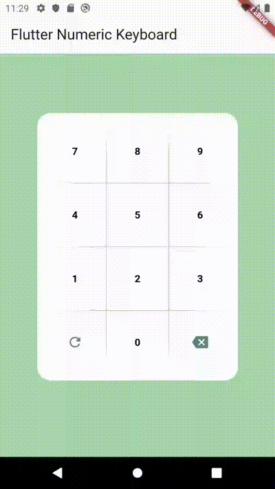

# flutter_numeric_keyboard

A customizable numeric keyboard widget

## Installation

Add `flutter_numeric_keyboard: ^1.0.0` in your `pubspec.yaml` dependencies. And import it:


```dart
import 'package:flutter_numeric_keyboard/flutter_numeric_keyboard.dart';
```

## How to use

```dart
FlutterNumericKeyboard()
```

## Params

```dart
FlutterNumericKeyboard(
              width: 300,
              height: 400,
              showResult: true,
              resultTextStyle: const TextStyle(
                  color: Colors.black,
                  fontSize: 20,
                  fontWeight: FontWeight.bold),
              resultFunction: (value) {
                print(value);
              },
              obscureResult: false,
              showDivider: true,
              rightIconBack: const Icon(
                Icons.backspace,
                color: Colors.blueGrey,
              ),
              showRightIcon: true,
              leftIconReset: const Icon(
                Icons.refresh,
                color: Colors.blueGrey,
              ),
              showLeftIcon: true,
              digitStyle: const TextStyle(
                  color: Colors.black,
                  fontSize: 15,
                  fontWeight: FontWeight.bold),
              backgroundColor: Colors.white,
              backgroundRadius: 20),
```





